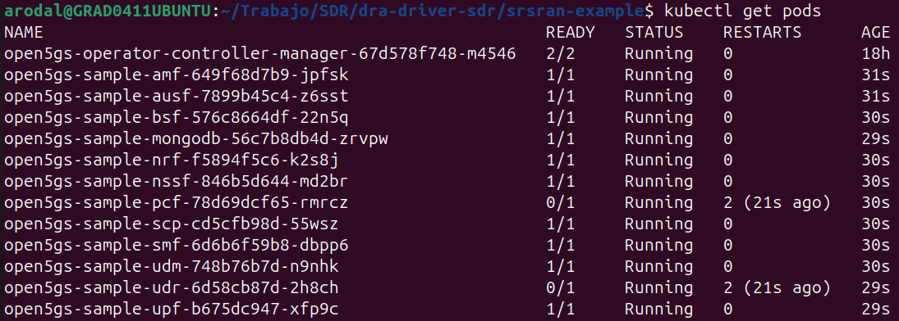
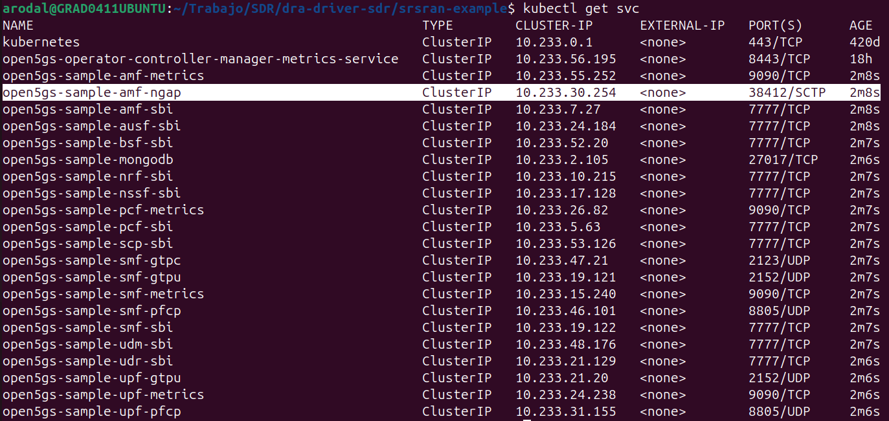
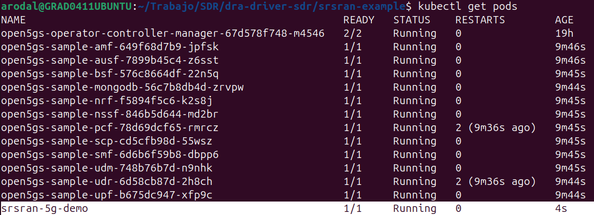
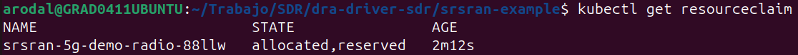
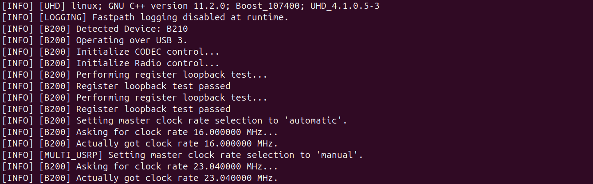
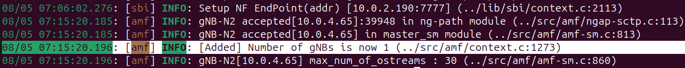

# DEMO: Using the Kubernetes DRA driver for SDR allocation (srsRAN + Open5GS)

## 1. Introduction
The goal of this lab is to demonstrate that a physical software-defined radio (SDR) can be seamlessly allocated to a Kubernetes Pod using **Dynamic Resource Allocation (DRA)** technology. While this guide uses a USB SDR (USRP B210) as the primary example, the exact same deployment works for an IP SDR (like the USRP X310) simply by changing the `deviceClassName` in the `ResourceClaimTemplate` from `sdr-usb` to `sdr-ip`. 

To perform this verification in a realistic environment, we will deploy a complete mobile network: we will use **Open5GS** as the network Core and **srsRAN** as the base station that will use the SDR attached to the Pod.

---

## 2. Network Core Deployment (Open5GS)

The first step to create our 5G network is to deploy the Core. To facilitate this task, we will use an **Operator** developed by Gradiant that automates the creation of all Open5GS components.

### Operator Installation
The Operator is easily installed using Helm. This command will download the official chart and deploy the controller in the cluster:
```bash
helm install open5gs-operator oci://registry-1.docker.io/gradiantcharts/open5gs-operator --version 1.0.7
```

### Network Definition (Open5GS Object)
Once the Operator is `Running`, we tell it to build our 5G Core by passing it a custom object of type `Open5GS`. We create the `open5gs-operator-deploy.yaml` file:

```yaml
apiVersion: net.gradiant.org/v1
kind: Open5GS
metadata:
  name: open5gs-sample
spec:
  configuration:
    slices:
      - sst: "1"
        sd: "0x111111"
```
*Explanation:* This YAML tells the Operator to deploy a Core named `open5gs-sample` configured to support a single Network Slice defined by service type 1 (`sst`) and differentiator `0x111111` (`sd`). The operator will read this and deploy the database (MongoDB) and all 5G functions (AMF, SMF, UPF, etc.).

By applying this file, the cluster will be populated with the 5G Core pods:
```bash
cd srsran-example
```
```bash
kubectl apply -f open5gs-operator-deploy.yaml
```


### Service Verification
Once the pods are `Running`, we need to know on which internal network address the Operator has deployed our **AMF** (the entry point for the antenna):
```bash
kubectl get svc
```


We look for the service ending in `-amf-ngap`. This is the address our radio will use to connect.

---

## 3. Radio Deployment (srsRAN)

With the network core running, we proceed to deploy the base station that will physically use our SDR antenna.

### Resource Claim Templates
For Kubernetes to assign the physical radio to the Pod, it is **mandatory** to define a `ResourceClaimTemplate`. This object tells DRA exactly what kind of device we are requesting.

```yaml
apiVersion: resource.k8s.io/v1
kind: ResourceClaimTemplate
metadata:
  name: sdr-template
spec:
  spec:
    devices:
      requests:
      - name: sdr-device
        exactly:
          deviceClassName: sdr-usb
```

> [!IMPORTANT]
> If you are using an IP SDR, simply change `deviceClassName: sdr-usb` to `deviceClassName: sdr-ip` in the `ResourceClaimTemplate` above.

### Radio Configuration (ConfigMap)
The radio needs to know which Core to connect to and how to configure the frequencies. We define a `ConfigMap` with the basic configurations, ensuring they match the network we created earlier:

```yaml
apiVersion: v1
kind: ConfigMap
metadata:
  name: srsran-gnb-config
data:
  gnb.yml: |
    cu_cp:
      amf:
        addr: "open5gs-sample-amf-ngap" # AMF-NGAP DNS
        bind_addr: "0.0.0.0"
        supported_tracking_areas:
          - tac: 1
            plmn_list:
              - plmn: "99970"
                tai_slice_support_list:
                  - sst: 1            # Must match the Operator
                    sd: 0x111111      # Must match the Operator
    ru_sdr:
      device_driver: uhd
      device_args: type=b200,num_recv_frames=64,num_send_frames=64
      srate: 23.04
      tx_gain: 45
      rx_gain: 45
      otw_format: sc12
    cell_cfg:
      dl_arfcn: 632628
      band: 78
      channel_bandwidth_MHz: 20
      common_scs: 30
      plmn: "99970"
      tac: 1
      pci: 1
    log:
      filename: /tmp/gnb.log
      all_level: info
```

### Pod Deployment
Finally, we deploy the container using the Gradiant image (`gradiant/srsran-5g`) and instruct it to claim the radio and mount our configuration:

```yaml
apiVersion: v1
kind: Pod
metadata:
  name: srsran-5g-demo
spec:
  containers:
  - name: gnb
    image: gradiant/srsran-5g:25_10
    command: ["/opt/srsRAN_Project/target/bin/gnb"]
    args: ["-c", "/etc/srsran/gnb.yml"]
    volumeMounts:
    - name: config-volume
      mountPath: /etc/srsran/
    resources:
      claims:
      - name: radio  # We request the radio
  resourceClaims:
  - name: radio
    resourceClaimTemplateName: sdr-template # We tie the request to the DRA Template
  volumes:
  - name: config-volume
    configMap:
      name: srsran-gnb-config
```
```bash
cd srsran-example
```
We apply the file:
```bash
kubectl apply -f srsran-5g-demo.yaml
```



---

## 4. Hardware and Connectivity Validation

To demonstrate that everything worked as expected, we will perform two fundamental checks:

### Check exclusive SDR allocation (DRA)
We want to verify that the cluster has created a reservation (Claim) physically linking the radio to the Pod. We run the following command:
```bash
kubectl get resourceclaims
```
A dynamically generated ResourceClaim should appear with its status indicating that it is correctly Assigned (Allocated).



### Check Radio Logs (Hardware Initialization)
Finally, we verify that the `srsran` container has received physical access to the antenna through DRA and was able to turn it on. We check the Pod logs:
```bash
kubectl logs srsran-5g-demo
```
In this output, we should look for two fundamental logs proving the success of the DRA driver:
1. `[INFO] [B200] Detected Device: B210`: Confirms that the container physically sees the USB port injected by Kubernetes.
2. `Actually got clock rate 23.040000 MHz`: Confirms that the UHD library has the correct permissions (cgroups) to interact with the board at a low level and program its oscillator.



### Check Core Logs (AMF)
The ultimate proof that the radio has successfully connected to the network is to check the AMF. We run:
```bash
kubectl logs deploy/open5gs-sample-amf
```
We must look for the message `[Added] Number of gNBs is now 1`, which officially confirms that the Core has accepted and registered the base station.



---

## 5. Conclusion
If all the previous steps have been completed and the logs show a successful connection between the radio and the Core, we can confirm the success of the test. The Kubernetes DRA driver is exclusively and functionally allocating SDR hardware to pods at runtime, allowing the deployment of complete 5G infrastructures.
